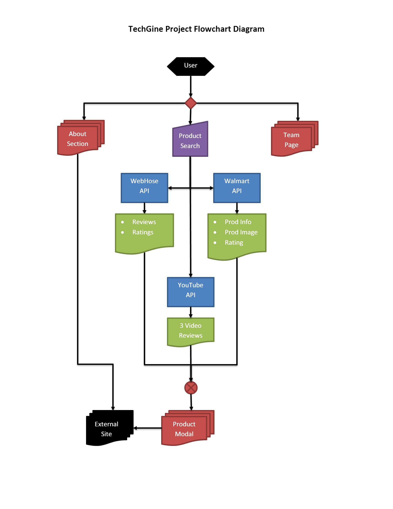

# Project: **techGine** -- Tech Product Review Search Aggregate

    

## Contents:
* [Team Members](#team-members)
* [Project Description](#project-description)
* [Project Design](#project-design)
* [APIs in Use](#apis-in-use)
* [Project Task Breakdown](#project-task-breakdown)
___

## Team Members:
* Sadé Browne - GitHub Master
* Jenn Chu
* Mark Kazanski
* Alize Nguyen
* Nicholas Sladden - Project Manager

## Project Description:

The techGine project provides a one-stop platform allowing users to research and compare electronic and tech products across an array of sources. Users can use the website to aggregate product searches and generate reviews at ease. Reviews include customer ratings from Best Buy, Walmart, and Amazon, as well as YouTube videos, news articles, and trending tweets from Twitter.

## Project Design:

### Mood Board

### WireFrame

## APIs in Use:
* Walmart API
* Webhose API
* Youtube API

## Project Task Breakdown:

* **Frontend: Web Design**: Alize (Nick as needed)
* **Backend: System Integration and Testing**: Mark
* **Backend: App.js and Integration**: Sade
* **Backend: Walmart and Youtube API**: Jenn
* **Backend: WebHose API and integration**: Nick

## Code Notes (Flow)

    

1. User search input
2. Walmart API for product info
3. Webhose API for reviews and rating
4. Youtube API for video reviews

### Project Obstacles
* API availability and usage
* Identical product availability
* Asynchronous programming
* Cross-origin resource sharing